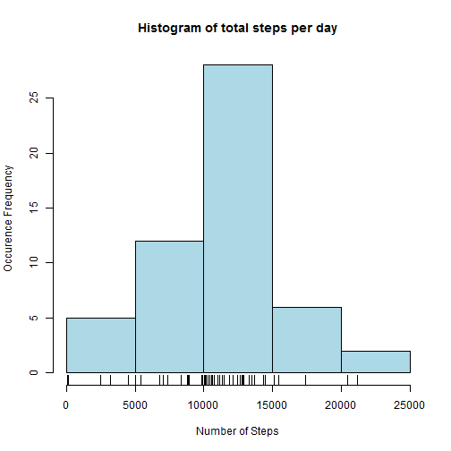
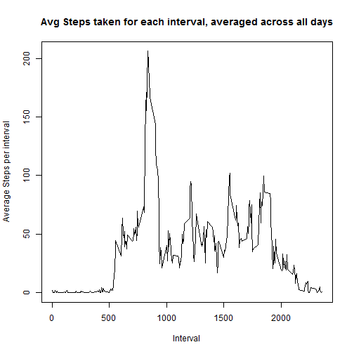
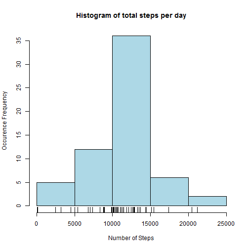
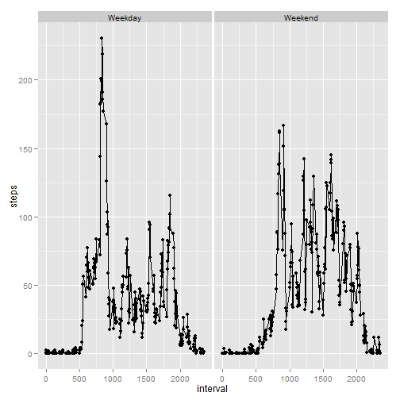

Submission Markdown (PA1 template)
==================================


The following contains the submission for Peer Review Assignment 1 for the Reproducible Research Course. The way each Part is set up is based on template provided by R.Peng on GitHub.

**Part 1: Loading and preprocessing the data**

The following code chunk downloads the CSV file required for the assignment. I had to use http instead of https in the url to avoid an error from occuring


```r
url <- "http://d396qusza40orc.cloudfront.net/repdata%2Fdata%2Factivity.zip"
download.file(url, "repdata-data-activity.zip", mode="wb")
unzip("repdata-data-activity.zip")
```


Next I load the packages I need for transforming data and creating graphs that I need for this assignment


```r
require(reshape2)
require(ggplot2)
```

Alright - now we read the CSV needed for the assignment, and then melt and cast the data set (after omitting NAs) to derive a data set that would be usable for plotting the necessary data and calculating descriptive statistics later.

```r
activity<-read.csv("activity.csv", header=TRUE)
activity_noNA <- na.omit(activity)
activity_noNA_melt <- melt(activity_noNA, id = c("date", "interval"), measure.vars = "steps")
steps_noNA_data <- dcast(activity_noNA_melt, date ~ variable, sum)
```

**Part 2: What is mean total number of steps taken per day?**

Here we plot the histogram that we need to describe the distribution of steps taken each day/ 


```r
hist(steps_noNA_data$steps, col = "lightblue", main = "Histogram of total steps per day", 
     xlab = "Number of Steps", ylab = "Occurence Frequency")
rug(steps_noNA_data$steps)
```

 


The mean is 10766.19 and the median is 10765.


**Part 3: What is the average daily activity pattern?**

First thing I do here is clean out the environment variables to avoid variable name confusion. 

```r
rm(list = ls())
```

Next, I set up the data (read, melt, cast) to get a dataset that I can use in a way similar to what I described in Part 1. Only difference here is that the casting is done on interval as opposed to day. 


```r
activity<-read.csv("activity.csv", header=TRUE)
activity_noNA <- na.omit(activity)
interval_melt <- melt(activity_noNA, id = c("date", "interval"), measure.vars = "steps")
interval_data <- dcast(interval_melt, interval ~ variable, mean)
```

Now that I have the data needed, I can plot the time series plot of the average number of steps taken for each 5 minute interval, averaged across all days.


```r
plot(interval_data$interval, interval_data$steps, type = "l", 
     main = "Avg Steps taken for each interval, averaged across all days", 
     xlab = "Interval", ylab = "Average Steps per interval")
```

 

*The 5-minute interval that, on average, contains the maximum number of steps* 
This interval is computed as follows: 


```r
max_interval_steps_index <- which.max(interval_data$steps)
interval_having_max_steps <- interval_data[max_interval_steps_index, ]$interval
```

The interval having on average the maximum number of steps is 835 and the index of this interval is `r max_interval_steps_index


**Part 4: Imputing missing values**

Again, first thing I do here is clean out the environment variables to avoid variable name confusion. 

```r
rm(list = ls())
```

Next, I set up the data (read, melt, cast) to get a dataset that I can use in a way similar to what I described in Part 4. 


```r
activity<-read.csv("activity.csv", header=TRUE)
activity_noNA <- na.omit(activity)
interval_melt <- melt(activity_noNA, id = c("date", "interval"), measure.vars = "steps")
interval_data <- dcast(interval_melt, interval ~ variable, mean)
```

The following code finds out how many rows actually have NAs in them: 


```r
complete_cases <- complete.cases(activity$steps, activity$date, activity$interval)
rows_with_NA <- sum(!complete_cases)
```

The number of rows containing NA values is 2304


What I have done (as described in the code below) is to take the average of the given interval that has a NA value associated with it and replaced the NA value with the average of the interval. See the inline comments to review what I am doing to achieve this imputation. 


```r
#First let's get the data frame containing only missing values (in any row)
#To do this, we need to extract the data set as a data frame first
missing <- as.data.frame(is.na(activity))
#Now let's mark the rows that have any NA in any row by creating a new column for it 
missing$any_row_missing <- missing$steps | missing$date | missing$interval
#missing_df is the data frame that has only rows with missing values 
missing_df <- activity[missing$any_row_missing, ]
#non_missing_df is the data frame that has rows with only complete value combinations 
non_missing_df <- activity[!missing$any_row_missing, ]


#The "interval_data" is a data set that contains the means of each interval, which was defined in a code chunk above. We use interval_data to replace the NAs in missing_df, thereby replacing NAs with the means of the intervals
imputed <- merge(missing_df, interval_data, by = "interval")
#Next we extract only the columns we need using cbind
imputed_missing <- as.data.frame(imputed$steps.y)
imputed_missing <- cbind(imputed_missing, imputed$date)
imputed_missing <- cbind(imputed_missing, imputed$interval)
#Name the columns appropriately...
colnames(imputed_missing) <- c("steps", "date", "interval")

#Now we have "imputed_missing", which is a data frame that contains means of intervals instead of NAs. We now need to append rows from the non missing data set, which we do using row binding. 
activity_imputed <- rbind(imputed_missing, non_missing_df)
#Sort the data frame ("activity_imputed") such that it is in the same order as the original data set
activity_imputed <- activity_imputed[order(activity_imputed$date, activity_imputed$interval), ]
```


*A histogram of the total number of steps taken each day after missing values are imputed*

We need to transform the data (melt, dcast) like before on the "activity_imputed" data set such that we have a 'graph-friendly' data set. 


```r
activity_imputed_melt <- melt(activity_imputed, id = c("date", "interval"), measure.vars = "steps")
imputed_data_daily <- dcast(activity_imputed_melt, date ~ variable, sum)
```

Now that we have the necessary data set, let's plot the histogram of the total number of steps taken each day. 


```r
hist(imputed_data_daily$steps, col = "lightblue", main = "Histogram of total steps per day", 
     xlab = "Number of Steps", ylab = "Occurence Frequency")
rug(imputed_data_daily$steps)
```

 

You can see that the occurence frequency has shifted in the new histogram (for example the longest bar in the histogram has a frequency of 35 instead of 25, as shown in the first histogram in this document). 

I also computed the new mean and median as follows: 

```r
mean2 <- mean(imputed_data_daily$steps)
median2 <- median(imputed_data_daily$steps)
```

The new mean is 10766.19 and the new median is 10766.19. The imputation strategy made the mean and median the same, for obvious reasons. 


**Part 5: Are there differences in activity patterns between weekdays and weekends?**

This time, I am not clearing out environment variables because I need variables from previous parts. 

To achieve this, we need to find the day names in the week associated with each date and then assign each day name to either 'Weekday' or 'Weekend'. This is done through the following code chunk: 


```r
activity_imputed$day_name <- weekdays(as.Date(as.character(activity_imputed$date)))
activity_imputed$day_type <- sapply(activity_imputed$day_name, switch, 
                                    Monday = 'Weekday', 
                                    Tuesday = 'Weekday', 
                                    Wednesday = 'Weekday', 
                                    Thursday = 'Weekday', 
                                    Friday = 'Weekday', 
                                    Saturday = 'Weekend', 
                                    Sunday = 'Weekend')
```

Now that we have our day type assignments, we can make a plot friendly data set, as done in previous parts. 

```r
activity_imputed_melt <- melt(activity_imputed, id = c("date", "interval", "day_type"), 
                              measure.vars = "steps")
imputed_interval_data <- dcast(activity_imputed_melt, interval + day_type ~ variable, mean)
```

Now we are ready to plot the average number of steps taken per 5-minute interval across weekdays and weekends. I use the ggplot package to plot this:

```r
qplot(interval, steps, data=imputed_interval_data, facets = .~day_type) + geom_line()
```

 


*End of report!*
